# [fit] I hate
### *public speaking*
## [fit] **So why do I keep doing it?**

^ SLOW

---
# [fit] Francisco Díaz

### _**franciscodiaz.cl**_
### @fco_diaz

^ I'm Francisco Díaz

^ I'm 31 y/o

^ iOS Dev for ~7 years now

---

^ SLOW

^ Software Engineer

---

# 2010 - 2014

^ SLOW

^ I never gave a talk

^ Never wrote a blog post

---

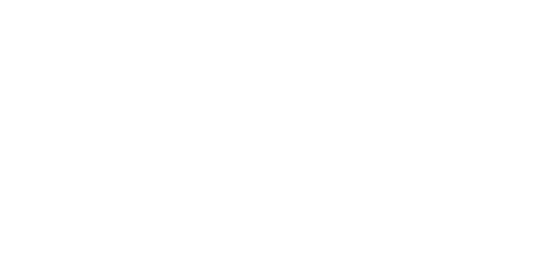

^ 2015 - 2017 co-organized a meetup in Chile

^ Host

^ Started giving talks

^ Creating community

---

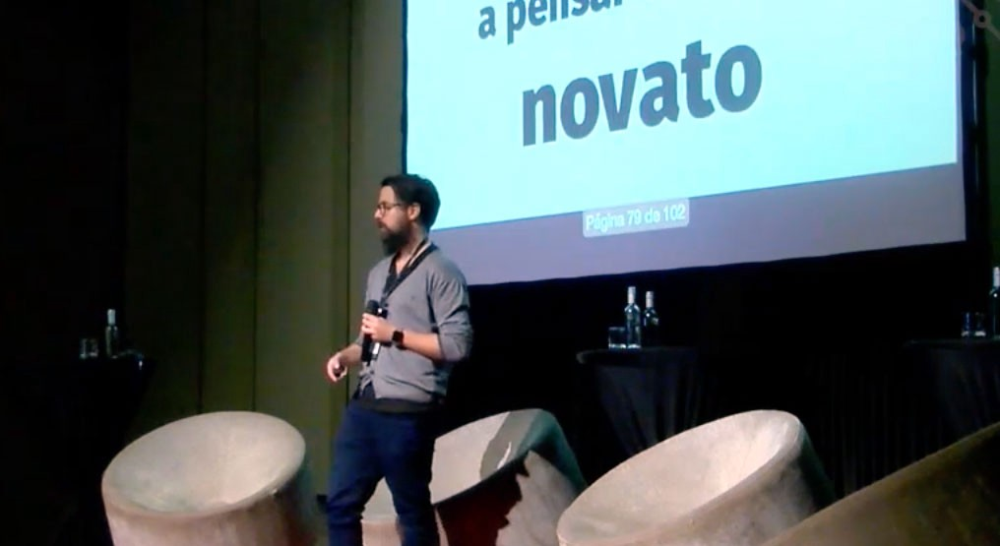

^ In 2016 I attended 9punto5.

^ A conference about the future of work 

^ In my hometown, Valdivia, Chile

^ 300 people

---

# [fit] Why do you
# [fit] _give talks?_

^ SLOW

^ Someone asked me

---

# "Give back 
## to the
# community"

---

# "Share 
## my knowledge"

^ But in reality

---

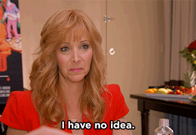

^ I had no idea.

^ And this is a particularly hard question for me

^ Because I know there are people that are naturally good at public speaking

^ But my process goes something like:

---

# _1 month_ 
### before the conference

^ SLOW

^ This is fun! I got in!

---

# _1 week_
### before the conference

^ Why did I apply?

---

# _yesterday_

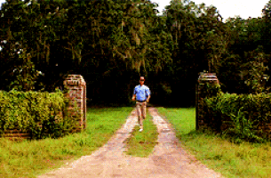

^ Run for your life

---

# 9_punto_5

^ Before my talk at 9punto5.

^ Walking back and forth.

^ Rehersing my talk.

^ Someone from the organizing team approached me later that evening.

^ "I could tell you were prepared".

---

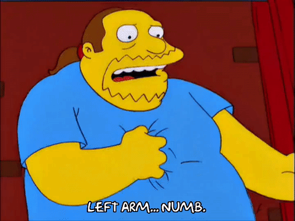

^ SLOW

^ Trying to calm myself

^ In reality I was about to have a *heart attack*

^ Exagerated

---

# I have a 
# [fit] _panic disorder_

^ I suffer from panic attacks

^ So I'm not particularly confortable in places where there's:

---

# A big crowd

^ SLOW

---

# Closed 
# [fit] spaces

---

# Under pressure

^ SLOW

---
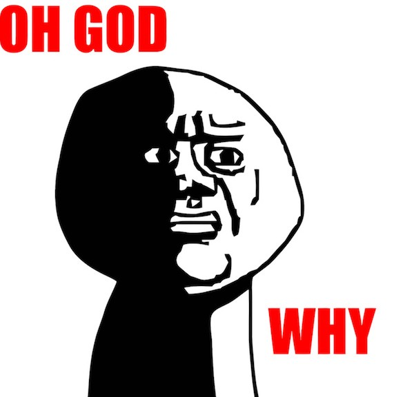

# [fit] _Conferences?_

^ Not my happy place

^ So why do I speak at conferences?

^ In Greek mythology there's a character I've always been interested in

---

# [fit] Sisyphus

^ After dying, he escaped from hell. After being recaptured he was punished by being forced to roll an immense rock up a hill only for it to go down when it hits the top.

---

# [fit] _Starting_
### is always
# _hard_

^ Starting is always the hardest part.

^ Once you start, inertia keeps you moving

---

# And we 
# [fit] _forget_

^ When you're already involved, you forget how hard it was to start

^ Not a lot of people talk about this.

^ It looks like it's easy for most people

---

#  And it looks
# _comfortable_

^ It looks like everybody is very confortable in stage talking

^ It's not. And that's ok

---

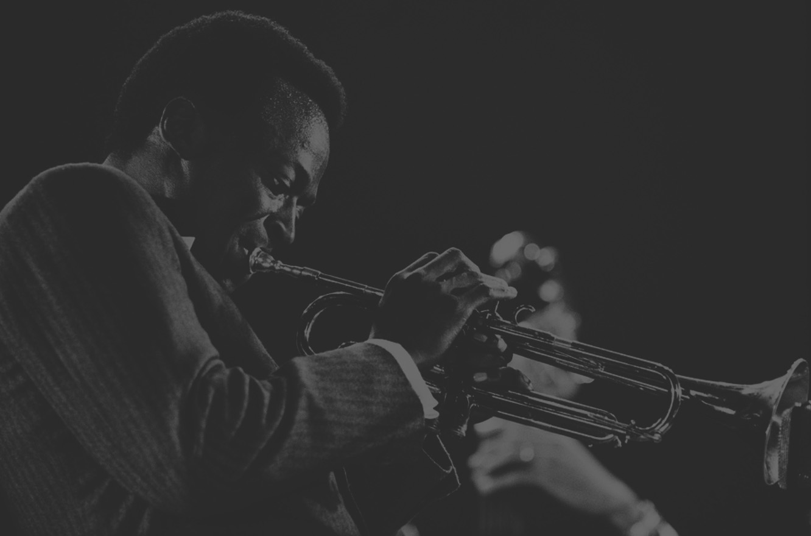

> You should never be comfortable, man. Being comfortable fouled up a lot of musicians.
-- Miles Davis

^ But feeling unconfortable and nervous is part of the process.

^ And it's part of growing

---

#[fit] No one ever _grew_
### _by staying in their_
## confort zone

^ SLOW

^ We gotta be a little unconfortable to:

^ Grow as engineers

^ Grow as people

---

# [fit] Why do I
# [fit] _talk in public?_

---

# ~~Despite~~
# _Because_
## they're unconfortable

---

---

# Afterwards..

^ SLOW

---

^ Why do I feel happy?

---

# **_I learnt_** something new

^ Either about what I'm talking
^ Or about myself

^ Or about someone else.

---

# **_I talked_** 
# to new people

^ I'm an introvert

^ In a corner by myself

^ When I talk, people come to me to talk

---

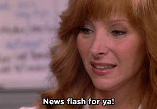

^ Conferences are not:

---

# _ARE NOT_
## about the talks

^ SLOW

---

## they're about
# [fit] _THE PEOPLE_

^ If you're not meeting someone new today

^ You're doing it wrong

---

# [fit] Why _didn't I give_
# [fit] talks before?

^ 2010 - 2014

---

# [fit]_**"My job is to**_
# [fit]_**write software"**_

^ SLOW

---

# [fit] My job is to
# _communicate_

^ The better I communicate, the better job I'm doing

^ Communicating with coworkers, in code, in documentation, etc.

---

# _improves_
## your communication skills

^ Talking in public forces you to:

^ Keep a coherent story

^ Keep your audience engaged

^ Communicate better

---

# _**"I don't have**_
## _**anything prepared"**_

^ SLOW

---

^ I got a little secret for ya

^ You don't need a lot prepared

---

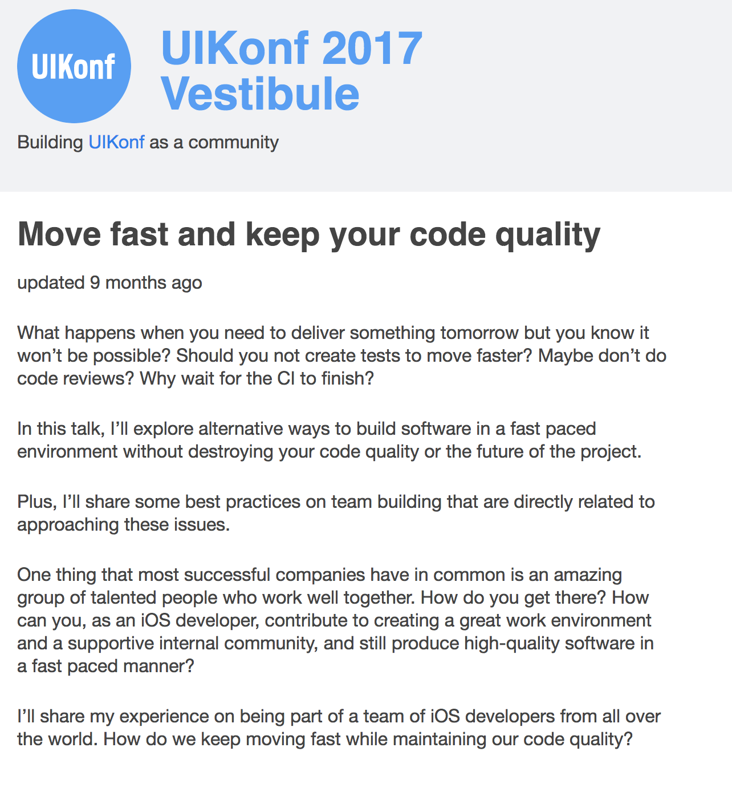

^ Last year I spoke at UIKonf in Berlin

^ I applied with this text

---

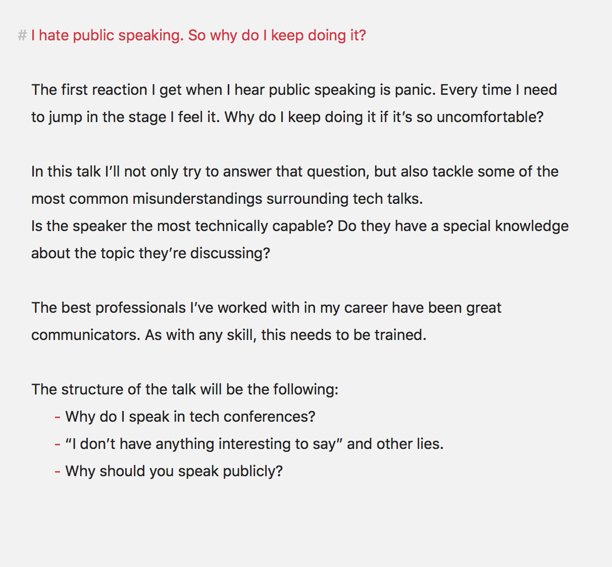

^ And for this talk, this was what I wrote.

^ So I'd encourage you to apply!

---

# _**"I don't know what to talk about"**_

^ SLOW

^ There's always something to talk about

---

### Teach when  
# [fit] _you learn something_

^ We're constantly learning

^ When you're learning, you're struggling

^ So it's the perfect time to be able to teach.

---

# _**"But I'm not an expert"**_

^ We're all afraid of not being seen as a noobie.

^ But if Im being honest...

---

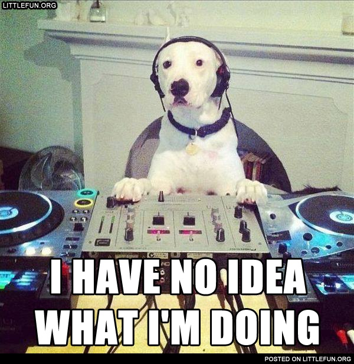

^ I'm not an expert in public speaking, and here I am.

^ A lot of times I feel like I'm not saying anything interesting

^ But at the end there's always someone that approaches me

---

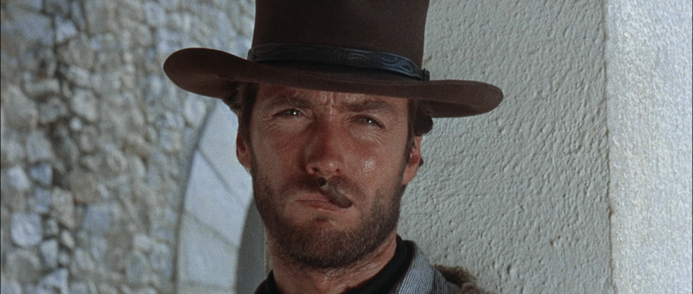

> My whole life has been one big improvisation
-- Clint Eastwood

^ SLOW

^ Because at the end of the day, we're all improvising

^ Instead of hiding this fact, *show it!*

---

## Show your learning
# [fit] _process_

^ Your mistakes are likely the mistakes of others

^ Your doubts are probably the same.

---

# _Making mistakes_
## is part of learning

^ SLOW

^ Don't be afraid to make mistakes and to make them in public.

^ We just gotta learn from them.

---

# _**"I don't know how to speak in public"**_

^ You're never gonna get better at something by not doing it.

^ As I said, I'm no expert, so I can only share my process:

---

# _Step 1:_
## Reasearch

---

# _Step 2:_
## Draft / Slides

---

 

# Deckset / MacDown

---

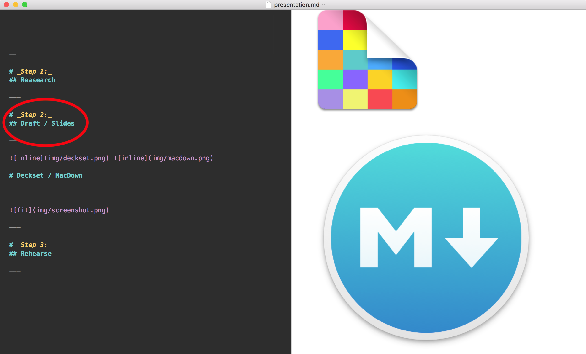

---

# _Step 3:_
## Rehearse

---

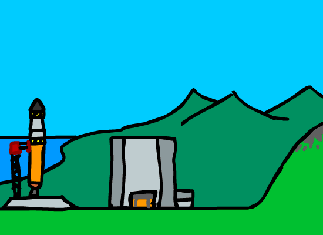

^ SLOW

^ Reasearch, Slides, Rehearse, Repeat

---

## _it seems like it never ends_

---

# _Going up_
### the hill

^ Because, as Sisyphus going up the hill...

^ It's an ongoing process

^ And you always feel like you're starting all over again

---

### But at
# [fit] _some point_

---

^ It's all done and you faced your fears

---

## Write
## Teach
## Organize
## Participate

^ Write a blog post

^ Teach a workshop

^ Organize a meetup

^ Participate in one

^ What you learnt today

^ What you liked about AltConf

^ Whatever you're passionate about

^ It's gonna be scary

^ But as a French philosopher once said

---

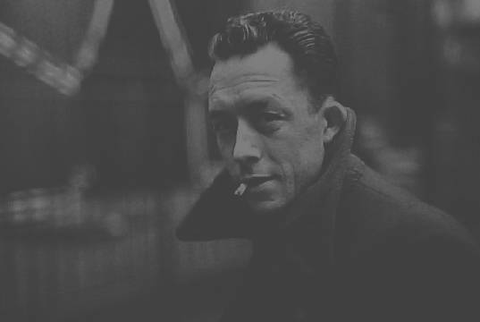
>  The struggle itself toward the heights is enough to fill a man's
heart.

---

> One must imagine Sisyphus happy.
-- Albert Camus

^ And I feel that's true. Just the struggle to conquer our fears is enough.

^ At the end of the day, I think we all end with a smile in our face.

---

# [fit] Thank you
### _**franciscodiaz.cl**_
### @fco_diaz